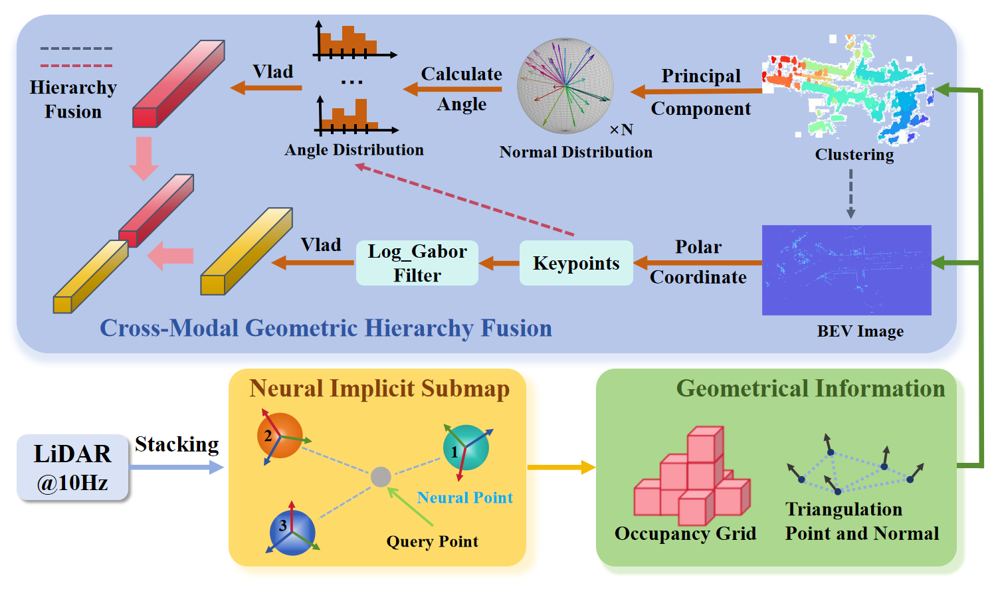

# CMGHF
Cross-Modal Geometric Hierarchy Fusion: An Implicit-Submap Driven Framework for Resilient 3D Place Recognition

LiDAR-based place recognition is critical for long-term autonomous driving without GPS. Existing handcrafted feature methods face dual limitations. First, descriptor instability occurs due to inconsistent point cloud density from motion and environmental changes during repeated traversals. Second, representation fragility arises from reliance on single-level geometric abstractions in complex scenes. To overcome these, we propose a novel framework for 3D place recognition. We introduce an implicit 3D representation using elastic neural points. This method is inherently resilient to variations in input density and yields uniformly distributed representations. From this, we derive occupancy grids and normal vectors. These enable the construction of fused descriptors that integrate complementary perspectives: macro-level spatial layouts from a bird’s-eye view and micro-scale surface geometries from 3D segments. Extensive evaluations on diverse datasets (KITTI, KITTI-360, MulRan, NCLT) demonstrate state-of-the-art performance. Our approach achieves an optimal balance between accuracy, runtime efficiency, and map memory footprint. It exhibits exceptional resilience and scalability. The code will be released soon.
* The code is being organized.
